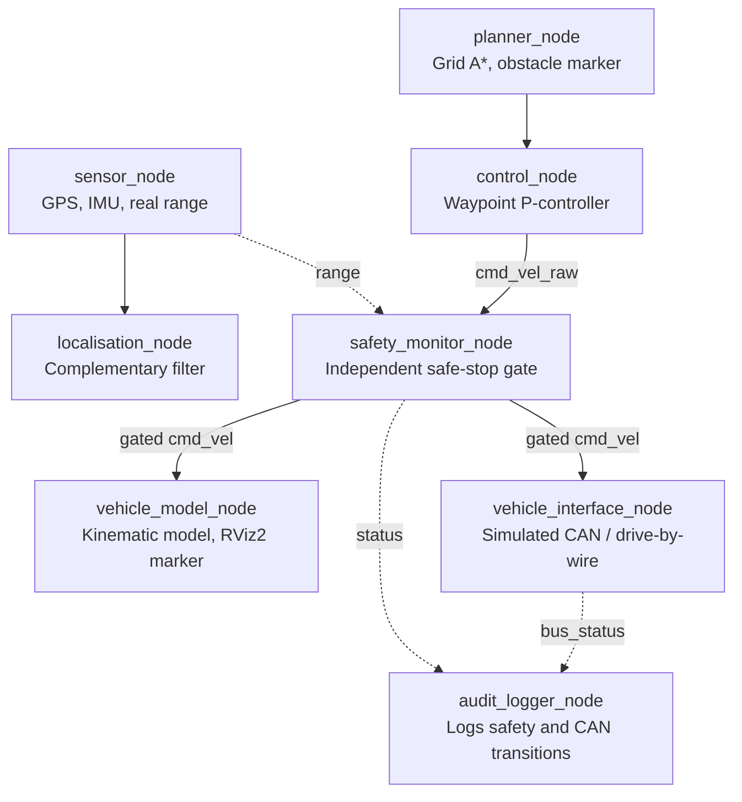

# Autonomous Mower Demo (ROS2)

A minimal but complete simulated autonomy stack for a ground vehicle, built to
demonstrate the core engineering patterns behind autonomous turf-care /
mower systems: sensing, localisation, planning, control, safety monitoring,
vehicle interface abstraction, and audit logging.

Built as a focused technical project ahead of an Autonomy Systems Engineer
interview, to have something concrete and honest to demo and discuss.
It is **not** presented as production-grade or field-tested. Every
simplification is flagged explicitly below.

## Why this project

The goal was to mirror the *shape* of a real autonomy stack: the same node
boundaries, message flow, and safety architecture a real system would have,
using synthetic data and simplified algorithms that are fully understandable
and explainable, rather than opaque or copy-pasted. Nothing here is a black
box: every design choice is one I can defend and extend on request.

## Architecture



*(Dashed arrows are observation-only, not command paths. `vehicle_interface_node`'s output is not yet wired into `vehicle_model_node`'s input, they are demonstrated independently, flagged explicitly below.)*

## Nodes and packages

| Package | Node | Purpose |
|---|---|---|
| `mower_sensors` | `sensor_node` | Publishes GPS (`NavSatFix`), IMU (`Imu`), and a range reading (`Range`) computed by ray-marching from the vehicle's real pose against known wall geometry |
| `mower_localisation` | `localisation_node` | Fuses GPS + IMU into a pose estimate via complementary filter |
| `mower_planner` | `planner_node` | Grid-based A* search, publishes a `nav_msgs/Path` plus an obstacle visualization marker |
| `mower_control` | `vehicle_model_node` | 2D kinematic vehicle model, integrates `cmd_vel`, publishes odom + RViz2 marker |
| `mower_control` | `control_node` | Proportional waypoint-following controller; on reaching either end of the path, reverses and re-walks the same A*-verified route rather than jumping to a distant waypoint |
| `mower_safety` | `safety_monitor_node` | Independent safety gate: monitors range, zeroes velocity on threshold breach; exposes a `/safety/reset` service for a short, time-limited manual override |
| `mower_vehicle_interface` | `vehicle_interface_node` | Simulated CAN/drive-by-wire abstraction with command-timeout/heartbeat safety |
| `mower_audit_log` | `audit_logger_node` | Independent audit-trail logger; writes structured JSONL entries only on safety/CAN state transitions |

## Mapping to the job requirements

**Lead integration of the autonomy stack (perception, localisation, planning, control)**

All demonstrated as separate, correctly-bounded ROS2 nodes communicating
over well-defined topics with standard message types: `sensor_node` feeds
`localisation_node` and (indirectly, via known geometry) `safety_monitor_node`;
`planner_node` feeds `control_node`, which feeds actuation. The project's
core value is the integration pattern, not any single algorithm's
sophistication.

**Design and implement safety systems, including safety controllers and
safe-stop functionality**

`safety_monitor_node` is the centrepiece: an architecturally independent
node that gates every velocity command based on live obstacle-range data
(now computed from real vehicle geometry, not a timer), verified live to
trigger and clear correctly at the threshold, actually zeroing the
vehicle's motion rather than just logging a warning. It also exposes an
explicit `/safety/reset` override service, a short, time-limited,
operator-invoked window, mirroring real e-stop reset semantics rather than
silently auto-clearing near an obstacle. See "Honest limitations" for what
a real safety-critical implementation would still need beyond this.

I can also speak concretely to how this maps onto real functional-safety
standards: **ISO 12100**'s risk-reduction hierarchy (this safety monitor
sits at the "safeguarding" level, since the collision hazard can't be
designed out), and **ISO 13849-1**'s Performance Level / Category
framework (this is a single-channel software implementation, roughly
Category B; a real safe-stop function would need Category 3 or 4,
redundant sensing or shutoff paths, likely combining a hardware channel
with the software one). In the UK, this work would ultimately need to
satisfy the **HSE** (workplace/machinery safety) and align with **OPSS**
product-conformity requirements, which are converging with the EU
Machinery Regulation's robotics-specific updates.

**Develop/integrate embedded software and vehicle control interfaces (CAN,
drive-by-wire)**

`vehicle_interface_node` demonstrates the conceptual architecture: command
translation into bus-style signals with arbitration IDs, plus a command
timeout/heartbeat check, a real and important drive-by-wire safety
behaviour (a stale/silent commander must not result in a stuck command),
verified live by publishing then stopping commands and observing the
fault-stop trigger.

**Sensor integration (LiDAR, radar, cameras, GPS/IMU)**

`sensor_node` publishes GPS, IMU, and a range reading (standing in for a
single LiDAR/ultrasonic beam) using the actual standard ROS2 sensor message
types. The range reading is computed via real line-of-sight ray-marching
from the vehicle's actual pose and heading, not a synthetic timer signal,
so downstream safety behaviour is now genuinely tied to proximity.

**Vehicle-level testing and validation, including field trials**

Every node in this project was built with an explicit checkpoint and
manually verified via live topic echo/hz before moving on, the same
discipline (verify each layer independently before trusting the integrated
system) that field trials apply at a larger scale. During development this
process surfaced two real, worth-discussing findings, see "Engineering
findings during development" below. This is the area where the project is
most obviously not a substitute for real field testing.

**Functional safety activities (HARA, safety case, certification readiness)**

Not implemented (out of scope for a few-hour project), but the safety
monitor's design was deliberately chosen to illustrate HARA-relevant
concepts: independent safety channels, single-point-of-failure analysis,
and explicit operator-acknowledged overrides rather than silent recovery.
See limitations below for the specific gaps a real HARA would flag.

## Engineering findings during development

Two real issues were found and addressed while building and testing this
project, both worth discussing directly as examples of a testing/validation
mindset applied at small scale:

- **Path-repeat control bug.** `planner_node` republishes the same path
  every 2 seconds so late-joining subscribers (e.g. RViz2) still see it.
  `control_node` originally reset its waypoint index to 0 on every
  republish once the path was complete, causing the vehicle to snap
  straight toward the original start point in a straight line that cut
  through the wall obstacle, since the P-controller has no independent
  obstacle awareness, it only avoids obstacles by following the
  pre-computed A* waypoint sequence in order. Fixed by having the
  controller detect genuine path changes only, and by reversing and
  re-walking the same verified path once either end is reached, instead of
  jumping to a distant waypoint.
- **Safe-stop deadlock.** After tying the range sensor to real vehicle
  geometry, a stationary vehicle facing an obstacle has a range reading
  that never improves on its own, since it isn't moving, its heading isn't
  changing, so a triggered safe-stop could persist indefinitely with no
  path to recovery. This is exactly the class of hazard a formal HARA
  would be expected to catch. Addressed with an explicit `/safety/reset`
  service requiring an operator-invoked action, rather than any form of
  silent auto-clearing near an obstacle.

## Honest limitations: what's simplified or faked, and what it maps to

This project prioritises being fully explainable over being maximally
realistic. Every simplification below is one I can speak to directly and
explain how it would differ in a production system.

- **GPS and IMU are still synthetic**, generated by simple deterministic
  math (sine waves, drift), not real hardware or even a physics simulator.
  The range sensor is now computed from real vehicle-pose geometry, but
  it's still a single ray-marched line-of-sight check, not a true
  multi-beam LiDAR/ultrasonic scan with a field-of-view cone, reflection
  physics, or a sensor noise model. It also duplicates wall geometry that
  `mower_planner` independently hardcodes, a real system would need a
  single shared map source, not two components silently agreeing to keep
  hardcoded copies in sync.
- **Localisation is a complementary filter with a fixed blend weight**, not
  a full EKF. A real system would likely use `robot_localization`'s
  `ekf_node` (the standard ROS2 package for this), with proper covariance
  propagation and a time-varying Kalman gain.
- **Planning is point-to-point A*, not coverage planning.** A real mower's
  planning problem is typically coverage (mow 100% of a field), and the
  map here is a small hand-coded grid, not derived from perception or a
  surveyed field boundary.
- **The vehicle model is purely kinematic**: no mass, inertia, wheel slip,
  or terrain interaction (grass, slopes; highly relevant for a real mower,
  and exactly the category of thing field trials would surface).
- **The control node is a simple P-controller on heading error**, not pure
  pursuit, a Stanley controller, or MPC: same category of problem, much
  simpler math.
- **The safety monitor is software-only**, running in the same ROS2 graph
  as everything else. If the ROS2 process or underlying OS crashes, this
  safety function stops working too. A real system needs an independent
  hardware safety channel (safety-rated PLC, hardwired e-stop, a watchdog
  that cuts power at the actuator level) that doesn't depend on software
  health. Under ISO 13849-1 this implementation is roughly Category B; a
  real safe-stop needs Category 3 or 4 redundancy. The manual reset
  service adds correct override *semantics* (explicit, time-limited,
  auto-re-arming) but does not itself add hardware-level redundancy.
- **The CAN/drive-by-wire layer is entirely simulated**: there is no real
  CAN bus, no DBC file, no transceiver hardware. `vehicle_interface_node`
  demonstrates the architecture and interface contract using plain Python
  objects, not real bit-packed frames on a real bus.
- **`vehicle_interface_node`'s output is not yet wired into
  `vehicle_model_node`**. A next step would be connecting its
  `actuated_cmd` topic as the vehicle model's actual input.
- **The audit log is a local, unsigned JSONL file**: no tamper-evidence
  (hash-chaining/signing), no centralized log shipping, no retention
  policy. A certification-relevant audit trail would need tamper-evident,
  centralized storage.
- **No field testing, no real hardware-in-the-loop, no formal HARA, no
  safety case.** This project demonstrates the software engineering
  patterns underlying these activities, not the activities themselves.

## Running it

Requires ROS2 Jazzy Jalisco on Ubuntu 24.04 (or adjust for your distro).

```bash
cd ~/mower_ws
colcon build
source install/setup.bash
```

Then, in separate terminals:

```bash
ros2 run mower_sensors sensor_node
ros2 run mower_localisation localisation_node
ros2 run mower_planner planner_node
ros2 run mower_control vehicle_model_node
ros2 run mower_control control_node
ros2 run mower_safety safety_monitor_node
ros2 run mower_vehicle_interface vehicle_interface_node
ros2 run mower_audit_log audit_logger_node
```

Visualize in RViz2 (Fixed Frame `map`; add Marker displays for
`/vehicle/marker`, `/planner/obstacle_marker`, `/safety/status_marker`, and
a Path display for `/planner/path`):

```bash
rviz2
```

Useful topics to watch:

```bash
ros2 topic echo /safety/status                              # SAFE / UNSAFE_STOPPED / OVERRIDE_ACTIVE
ros2 topic echo /vehicle/odom --field pose.pose.position     # vehicle position
ros2 topic echo /vehicle_interface/bus_status                # simulated CAN status
tail -f ~/mower_ws/audit_logs/audit_*.jsonl                  # audit trail
```

If the vehicle gets stuck facing an obstacle (a stationary heading never
improving its own range reading), open a short manual override window:

```bash
ros2 service call /safety/reset std_srvs/srv/Trigger {}
```

## What I'd do next with more time

- Wire `vehicle_interface_node` into `vehicle_model_node` to close the full
  chain end to end.
- Replace the complementary filter with `robot_localization`'s `ekf_node`.
- Add a coverage planner (boustrophedon sweep) alongside the A* planner.
- Move the wall/map geometry to a single shared source (e.g. a published
  `nav_msgs/OccupancyGrid`) instead of duplicated hardcoded copies in
  `mower_sensors` and `mower_planner`.
- Sketch (even informally, not a full HARA) a hazard list for this specific
  system as a talking point, including the two findings documented above,
  and how each would be mitigated in a real design.
